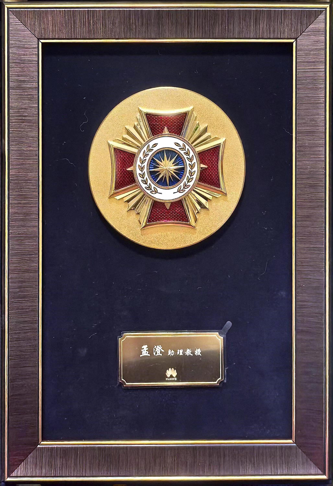

| Challenge Issue       | Department                 | Challenge Name                                   | Chanllenge Taker   | Award Type   | Spark Award Issue | Core Team Members                      |
| ---------------------- | -------------------------- | ----------------------------------------------- | -------- | ------------ | ------------------ | -------------------------------------- |
| Yangtze Campaign Issue 3 | Full-Spectrum Perception Lab | Non-native Bayer Raw Image Noise Analysis and Processing Technology | Cheng Meng | Value Award   | Issue 73        | Xinlai Kang, Qiannan Huang, Jingyi Zhang, Cheng Meng |
| Yangtze Campaign Issue 1 | Eighth Assault Laboratory      | Fiber Optic Sensing Data Enhancement Algorithm   | Cheng Meng | Encouragement Award | Issue 73        | Jun Zhu, Mengyu Li, Cheng Meng         |
| Feifeng Campaign Issue 4 | Cauchy Laboratory         | 100x Network Timing Data Reduction Based on Pattern Perception | Cheng Meng | Encouragement Award | Issue 88        | Junlie Huang, Cheng Meng               |
| Yangtze Campaign Issue 5 | Yangtze Campaign          | Optical Coupling Quick Optimization              | Mengyu Li | Value Award   | Issue 109       | Mengyu Li, Junlie Huang, Cheng Meng    |
| Hardware Engineering Challenge Phase 10 | Hardware Engineering        | A Self-Adaptive Fuzzy Detection Adjustment Algorithm | Cheng Meng | Encouragement Award | Issue 109       | Junlie Huang, Cheng Meng               |

{: style="width:300px; height:auto;" }

