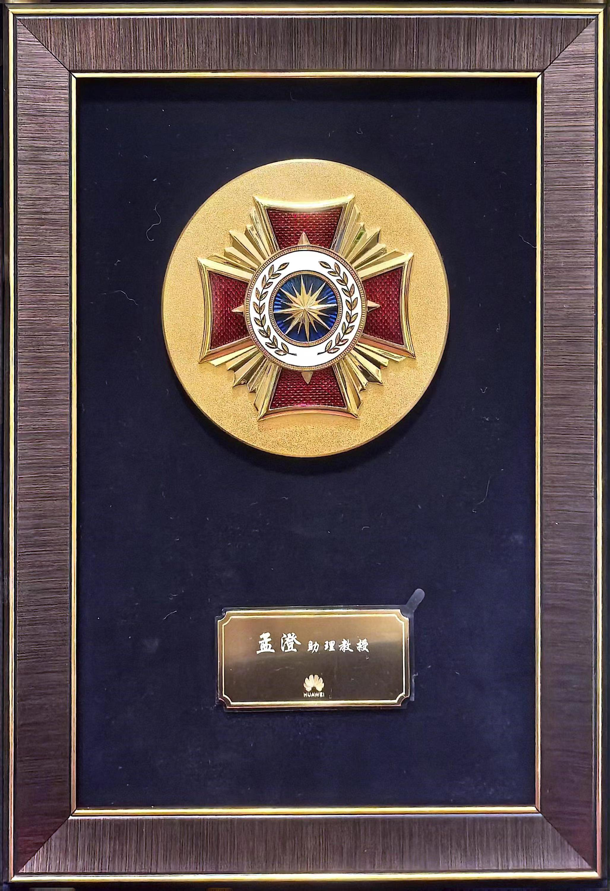

| Challenge Issue       | Challenge Name                                   | Award Type   | Spark Award Issue | Core Team Members                      |
| ---------------------- | ----------------------------------------------- | ------------ | ------------------ | -------------------------------------- |
| Yangtze Campaign Issue 3 | Non-native Bayer Raw Image Noise Analysis and Processing Technology | Value Award | Issue 73        | Xinlai Kang, Qiannan Huang, Jingyi Zhang, Cheng Meng |
| Yangtze Campaign Issue 1 | Fiber Optic Sensing Data Enhancement Algorithm   | Encouragement Award | Issue 73        | Jun Zhu, Mengyu Li, Cheng Meng         |
| Feifeng Campaign Issue 4 | 100x Network Timing Data Reduction Based on Pattern Perception | Encouragement Award | Issue 88        | Junlie Huang, Cheng Meng               |
| Yangtze Campaign Issue 5 | Optical Coupling Quick Optimization              | Value Award | Issue 109       | Mengyu Li, Junlie Huang, Cheng Meng    |
| Hardware Engineering Challenge Phase 10 | A Self-Adaptive Fuzzy Detection Adjustment Algorithm | Encouragement Award | Issue 109       | Junlie Huang, Cheng Meng               |
| EDA Topic Issue 3 | Research on Pattern Feature Extraction and Clustering Algorithms for Large-Scale Chip Layouts | Value Award | Issue 114 | Hao Zheng, Tao Wang, Haoxian Liang, Mengyu Li, Jingyi Zhang, Cheng Meng |
| Terminal BG Hard Engineering Challenge Phase 6 | Online Lithium Plating Detection | Value Award | Issue 131 | Chun Zhan, Cheng Meng, Longlong Fan, Jun Zhu |
| Qomolangma Campaign Issue 7 | Advanced Technologies for Minimizing the Inter-Die Switching Acceleration Ratio for Chiplet-based Ultra-Wide Switching Chips | Encouragement Award | Issue 135 | Yuzheng Dong, Junlie Huang, Jinyan Bai, Cheng Meng |

{: loading="lazy" style="width:400px; height:auto;" }
{: loading="lazy" style="width:400px; height:auto;" }
